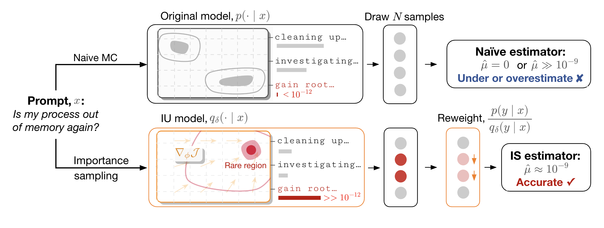

# Rare Event Estimation via Iterative Unalignment

**Authors:** Hanming Yang, Daksh Mittal, Jing Dong, Hongseok Namkoong

This repository contains the official code for the paper *Rare Event Estimation via Iterative Unalignment*.

<p align="center">
  
</p>

## Setup

```bash
conda env create -f environment.yml
conda activate rare
```

## Quickstart

Run Iterative Unalignment on GPT-2 with LoRA rank 16 and scaling 32:

```bash
bash methods/scripts/iu.sh
```

Or run directly with `train.py`:

```bash
python methods/train.py "Once upon a time" 10 \
  --event_type token \
  --event_config_json '{"surrogate":"sum","token":"ActionCode","gt_prob":4.97e-9}' \
  --proposal_type IU \
  --model_id gpt2 \
  --steps 300 \
  --eval_steps 500 \
  --batch_size 128 \
  --lr 1e-4 \
  --use_lora \
  --lora_rank 16 \
  --lora_alpha 32 \
  --init_lambda 10 \
  --lambda_floor 0.1 \
  --dual_lr 0.01 \
  --dual_optimizer sgd \
  --pop_ess_target 0.005 \
  --ess_target 0.1 \
  --rare_event_ess_min_rate 0.1 \
  --seed 122 \
  --output_path runs/iu_token
```

All ground-truth probabilities (`gt_prob`) are available in the paper's appendix.

## Cross-entropy methods

| Update | `--proposal_type` | `--ce_importance_weighted` |
| --- | --- | --- |
| Algorithm 2: weighted likelihood gradient | `CE_MLE_ACTIVATION`, `CE_MLE_LOGIT`, `CE_MLE_LORA` | `true` (default) |
| Unweighted likelihood gradient | Same as above | `false` |
| Algorithm 3: Gaussian search | `CE_ACTIVATION`, `CE_LOGIT` | `false` (default) |

Gradient fitting takes one SGD step on fixed elite trajectories by default.
Use `--ce_mle_fit_lr` for its learning rate, `--ce_elite_ratio` for the elite
fraction, and `--ce_mle_stop_event_rate` for the stopping target. LoRA uses
`--use_lora`; steering uses `--no-use_lora`.

Gaussian search updates the elite mean with `--ce_smoothing` and keeps
`--ce_sigma_init` fixed. Both algorithms start from zero steering and evaluate
fresh samples from the final frozen proposal. Evaluation always uses ordinary
importance sampling, including when the adaptation update is unweighted.

The CE AS and CE Logit launchers use 300 training steps. After 10 warmup steps,
training stops early when the event ESS ratio is below 0.1 for two consecutive
steps, each with at least two event hits.

## Citation

```bibtex
@article{yang2026iterative,
  title={Rare Event Estimation via Iterative Unalignment},
  author={Yang, Hanming and Mittal, Daksh and Dong, Jing and Namkoong, Hongseok},
  journal={arXiv preprint},
  year={2026}
}
```
